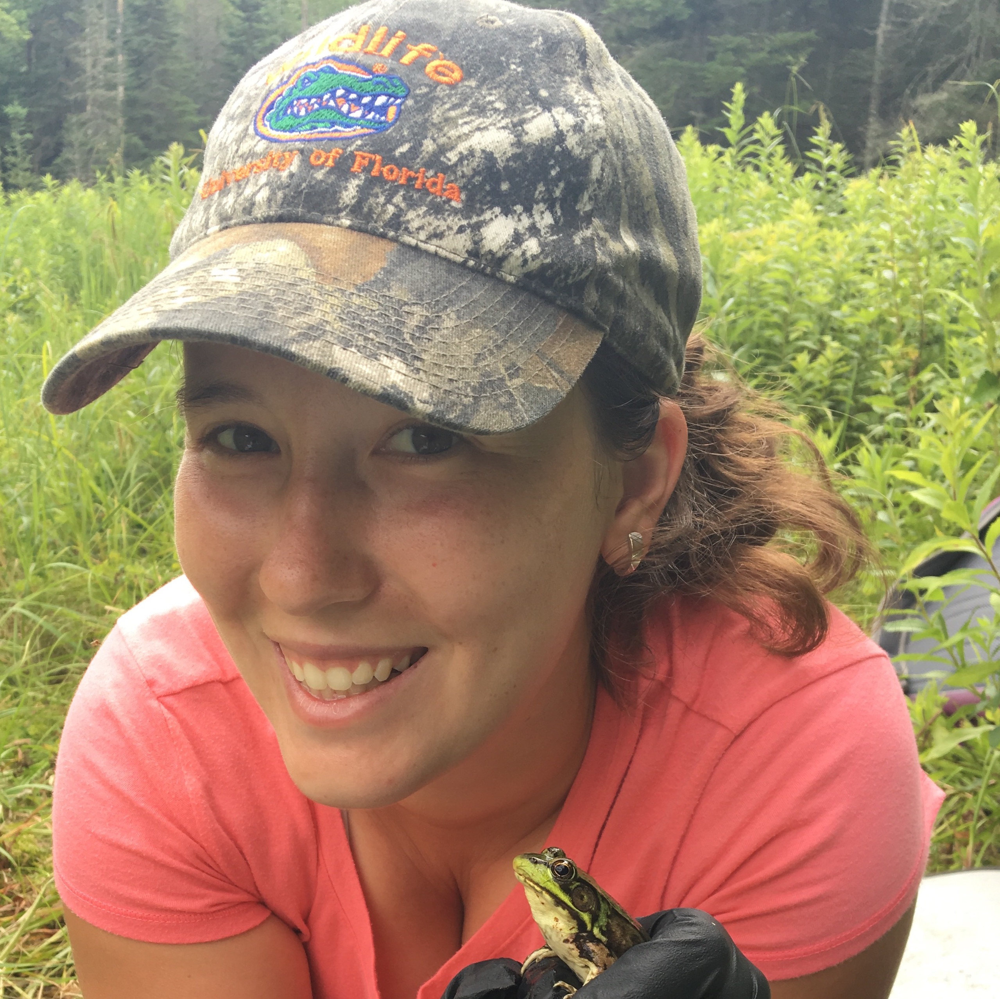

#### TA: Lauren Ash 
Office: Marsh Life Science 211   
Office Hours: Tuesday 11-1pm and by appointment    
Email: lvash@uvm.edu   

## Helpful Links   
* [Course Webpage](https://gotellilab.github.io/Bio381/)   
* [Lecture Videos](https://ngotelli.github.io/Bio381Vids)  
* [RMarkdown Cheatsheet](https://www.rstudio.com/wp-content/uploads/2015/02/rmarkdown-cheatsheet.pdf)   
* [Github website templates](https://jekyllthemes.io/)   
* [R help](http://stackoverflow.com/questions/tagged/r)   

## Table of contents for Homework Assignments    
* [Week 1 (Feb 3, 2021): Program Installation ](#id-section1)
* [Week 2: ](#id-section2)
* [Week 3: ](#id-section3)
* [Week 4: ](#id-section4)
* [Week 5: ](#id-section5)
* [Week 6: ](#id-section6) 
* [Week 7: ](#id-section7)
* [Week 8: ](#id-section8)
* [Week 9: ](#id-section9)  
* [Week 10: ](#id-section10)
* [Week 11: ](#id-section11)  
* [Week 12: ](#id-section12)  

## Lab Assignments and Notes

------

### Week 1: Program Installation  
#### February 3, 2021
[Assignment Page](https://gotellilab.github.io/Bio381/Homeworks/Homework01_S2021.html)   
   
**Due:**   
1. R, RStudio/tinytex, Typora, and Github up and working!   
   
**Resources:**  
   
* [Installation instructions](https://gotellilab.github.io/Bio381/CourseMaterials/Installation_Instructions.html)     
* [`tinytex` package](https://yihui.org/tinytex/)   

------

### Week 2: Setting up your webpage  
#### February 10, 2021
[Assignment Page](https://gotellilab.github.io/Bio381/Homeworks/Homework02_S2021.html) 
   
**Due:**  
   
In Slack, send:   
1. A link to your Github page    
2. A link to your Bio381 webpage  
3. A fun fact about yourself (if you haven't already)   
 
**Resources:** 
  
* [Lecture Notes: Github](https://gotellilab.github.io/Bio381/Lectures/Lecture02_S2021.html)   

------

### Week 3:    

------

### Week 4: 

------

   
### Week 5: 

------

   
### Week 6: 

------

### Week 8: 

------

### Week 10: 

------

### Week 11: 

------

### Week 12: 
